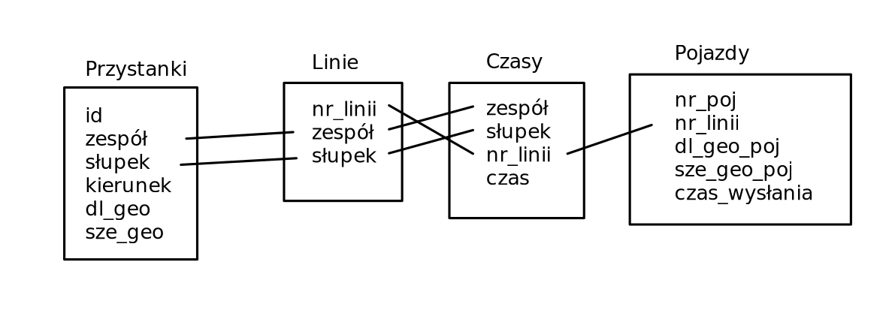

# Wyróżnione problemy
W prawdopodobnej kolejności rozwiązywania:
1. Ściąganie danych
2. Architektura aplikacji
3. Zapis danych
4. Analiza danych
5. Interfejs użytkownika
6. Testowanie

# Ściąganie danych
Z tych użytecznych zasobów wśród danych z https://api.um.warszawa.pl możemy wyróżnić:
- Nieuciążliwe - aktualizacja 1 raz na dzień
- Uciążliwe - potrzebna aktualizacja co około parenaście (>=10) sekund

Interfejsy dostępnych API zapisane w formacie pobiera argumenty => zwraca wyniki.
`(argumenty) => wyniki`
`[]` oznacza że zwracana jest tablica wyników

## Współrzędne przystanków (Dbstore API, nieuciążliwe)
Możliwe zapytania:
- `() => (nr_zespolu_przystanku, nr_slupka, nazwa_tekstowa_przystanku, id_ulicy, szerekosc_geo, dlugosc_geo, kierunek)[]`

## Rozkłady (Dbtimetable API, nieuciążliwe)
Możliwe zapytania (**niestety tylko pojedyńcze zapytanie dla każdego przystanku i linii**):
- `(nazwa_tekstowa_przystanku) => nr_zespolu_przystanku`
- `(nr_zespolu_przystanku, nr_slupka) => nr_linii[]`
- `(nr_zespolu_przystanku, nr_slupka, nr_linii) => (brygada, kierunek, trasa, czas)[]`

## Trasy (DATASTORE API, nieuciążliwe)
Możliwe zapytania:
- `() => (nr_linii, nazwy_tras[], lista_przystankow[], id_ulicy, nr_zespolu_przystanku, nr_slupka, odleglosc)`

**Niestety jedyny sposób jaki znalazłem na połączenie nazwy_tras z inną bazą jest przez "Dbtimetable API", a to przyjmuje tylko pojedyńcze zapytania, ale możliwe że i tak będziemy w taki sposób musieli to zrobć**

## Słownik (DATASTORE API, nieuciążliwe)
Jakieś rzeczy w stylu co oznacza numer w typie przystanku, skróty dwuliterowe dla miejsc i podobne rzeczy.

## POŁOŻENIA POJAZDÓW (DATASTORE API, uciążliwe)
`typ_pojazdu - autobus/tramwaj`
Możliwe zapytania:
- `(typ_pojazdu) => (nr_linii, szerekosc_geo_pojazdu, dlugosc_geo_pojazdu, nr_pojazdu, czas_wyslania_lokalizacji)[]`

# Proponowana architektura aplikacji
W kolejności od najlepszej:
1. serwer-klient
Serwer ściąga i analizuje dane, co parenaście sekund, ciągle zapisuje opóźnienia. Klientem jest aplikacja graficzna, która wysyła zapytanie o dany przystanek, dostaje w odpowiedzi linie które się zatrzymują na nim i ich opóźnienia.
2. Tylko klient
Wszystko dzieje się na kliencie. Klient używa API do ściągnięcia i zbudowania odpowiednich struktur oraz aktualizuje co parenaście sekund.
Możliwe wady:
	- opóźnienie spowodowane zbieraniem danych i zakwalifikowaniem pojazdów do tras przy włączeniu
	
	
# Zapis danych
W kolejności od najlepszej:
1. relacyjna baza danych SQL (postgresql)
Jeśli okaże się zbyt wolne możemy również spróbować wielowątkowość.
Możemy również spróbować trzymać całą bazę w RAMie, poprzez np. któryś z linuxowych systemów plików (ramfs, tmpfs) bo nie są to dane, które musimy przechowywać na stałe.
Zalety:
	- prosta selekcja danych jak już zostaną włożone
	- prosta obsługa
	- dane z API są powiązane relacjami
2. Baza danych noSQL (np. redis)
Bazy danych noSQL to praktycznie wygloryfikowane tablice hashujące, możemy też użyć pythonowych struktur dla testów jeśli przedstawienie danych w bazie SQL będzie zbyt trudne lub nie będziemy potrzebować skomplikowanych kwerend.
Właściwości:
	- szybsza i daje więcej kontroli nad sposobem rozmieszczenia danych
	- wymaga wcześniejszego przygotowania danych do naszego problemu
	
	

## Przykładowy plan na relacyjną bazę danych
Każda jest możliwa do skonstruowania dzięki zapytaniu do pojedyńczego z wymienionych API. Dane z analizy nie są uzwględnione.

	
# Analiza danych
Będzie składać się z kroków:
1. Aktualizacji bazy danych autobusów
2. Przypisaniu do każdego trasy i kierunku (**jak to zrobić?**)
3. Sprawdzeniu czy jest w bliskiej odległości do któregokolwiek z przystanków jego linii
4. Jeśli tak, zapisz jego obecny przystanek, policz opóźnienie `spóźnienie = czas_wysłania_gps - czas_w_rozkładzie`
5. Zapisz spóźnienie dla danego pojazdu i przystanek na którym się znajduje
6. Pytania o przystanki wcześniejsze zwracają "odjechał", późniejsze "niedojechał", ewentualnie z obecnym opóźnieniem

# Interfejs użytkownika
Do mapy można skorzystać z otwartej mapy [openstreetmap](https://pl.wikipedia.org/wiki/OpenStreetMap). Wystarczy ściągnąć mapę dla Warszawy.
Biblioteki do dynamicznego wyświetlania: https://wiki.openstreetmap.org/wiki/Software_libraries#Displaying_interactive_maps

Resztę interfejsu można wybrać ze znanych bibliotek np. qt, Tkinter, gtk.
Ewentualnie można by rozmyśleć zrobienie aplikacji webowej i użycie np. platformy [electron](https://www.electronjs.org/) do wyświetlania interfejsu.

Ze względu na niski próg wejścia, dużą liczbę bibliotek, wysokopoziomowość i dynamiczne typowanie najlepszy język to byłby Python. Zarówno do analizy jak i wyświetlania.

# W skrócie schemat działania
1. Ściągnięcie danych dla przystanków, umiejscowienie ich na mapie
2. Dla każdego ściągniętego przystanku wykonać zapytanie do Dbtimetable API o wszystkie linie na danym przystanku (7007 zapytań)
3. Dla każdej linii na każdym przystanku wykonać zapytanie do Dbtimetable API o czasy o których mają przyjeżdżać autobusy (7007 * kilka zapytań)
4. Ściągnąć obecnie jeżdżące autobusy, przyporządkować je do tras (zbiór przystanków które autobus danej linii odwiedza) i kierunków
5. Monitorować kiedy autobusy się zbliżają do jakiegoś przystanku ze swojej trasy, sprawdzać tak każdy autobus. Nie powinno być jakoś bardzo długo mi zwraca ~800 autobusów (01/11/2023 03:31)
6. Jak jest wystarczająco blisko przystanku swojej trasy to zapisać czas opóźnienia dla tego autobusu

# Testowanie
Jakieś testy jednostkowe, ręczne sprawdzanie czy działa? Idk

# Potencjalne problemy i pytania
- Klasyfikacja obecnych pojazdów do odpowiedniej trasy (kierunek i przystanek na którym się znajdują)
- Co to "brygada" w tych danych?
